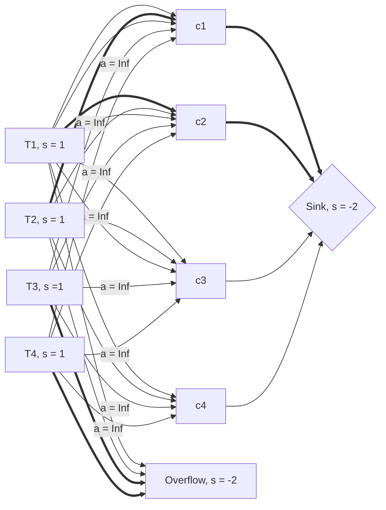
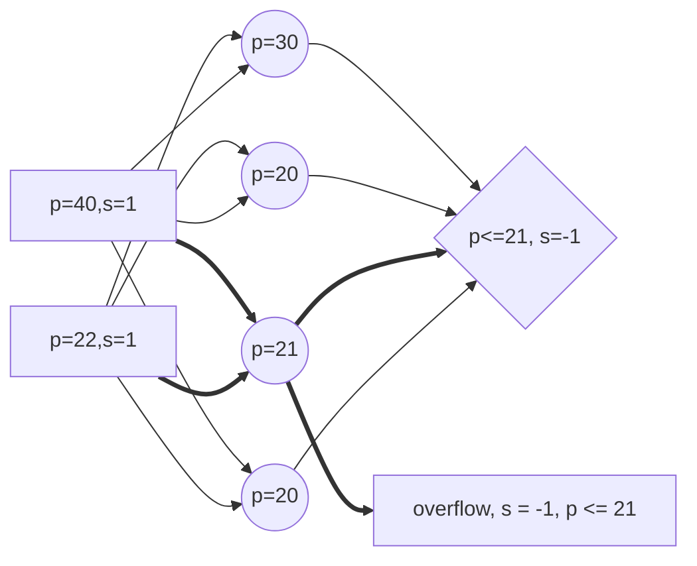
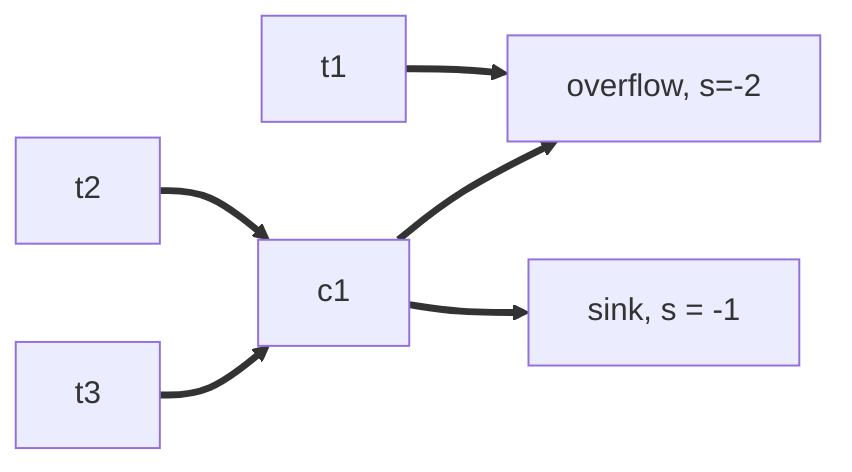

> Written with [StackEdit](https://stackedit.io/).

Suppose that this pair of dual solutions for MCF representations of two distinct 1-1 matching problems ---

```mermaid

graph LR

t1[p=4,s=1] == a=3 ==> c1((p=2))

t1 == a=1 ==> c2((p=3))

c1 --> Sink1{2<=p<=3, s=-1}

c2 --> Sink1

t2[p=40,s=1] == a=30 ==> c3((p=20))

t2 == a=10 ==> c4((p=30))

c3 --> Sink2{20<=p<=30, s=-1}

c4 --> Sink2

```

--- is to be combined to form a candidate solution for the dual of a single, combined 1-1 matching problem:

```mermaid

graph LR

t1[p=?,s=1] == a=3 ==> c1((p=?))

t1 == a=1 ==> c2((p=?))

c1 --> Sink{p=?, s=-2}

c2 --> Sink

t2[p=?,s=1] == a=30 ==> c3((p=?))

t2 == a=10 ==> c4((p=?))

c3 --> Sink

c4 --> Sink

```

Note that this combined problem neither adds or subtracts matching possibilities, treament-control arcs, nor modifies any arc costs. It's intended as the simplest possible scenario.


In the original pair of problems, I've denoted the range of prices on the sink node that can satisfy CS together with a flow that meets supply and capacity constraints. I've constructed things in such a way that these two ranges do not overlap. As a result, carrying over to the combined network the remaining nodes' prices results in a price vector that can't satisfy CS together with a feasible flow.


On the other hand, the price vectors for either of the original problems remain optimal if shifted up or down by the same amount. So one should simply shift, then merge:


```mermaid

graph LR

t1[p=4,s=1] == a=3 ==> c1((p=2))

t1 == a=1 ==> c2((p=3))

c1 --> Sink1{2<=p<=3, s=-1}

c2 --> Sink1

t2[p=40,s=1] == a=30 ==> c3((p=20))

t2 == a=10 ==> c4((p=30))

c3 --> Sink2{20<=p<=30, s=-1}

c4 --> Sink2

```


becomes


```mermaid

graph LR

t1[p=22,s=1] == a=3 ==> c1((p=20))

t1 == a=1 ==> c2((p=21))

c1 --> Sink1{20<=p<=21, s=-1}

c2 --> Sink1

t2[p=40,s=1] == a=30 ==> c3((p=20))

t2 == a=10 ==> c4((p=30))

c3 --> Sink2{20<=p<=30, s=-1}

c4 --> Sink2

```


and is then merged to give


```mermaid
graph LR
t1[p=22,s=1] == a=3 ==> c1((p=20))
t1 == a=1 ==> c2((p=21))
c1 --> Sink{20<=p<=21, s=-2}
c2 --> Sink
t2[p=40,s=1] == a=30 ==> c3((p=20))
t2 == a=10 ==> c4((p=30))
c3 --> Sink
c4 --> Sink
```


I conclude from this that when merging solutions to separate subproblems, the first thing to do is to cycle through the subproblem solutions and shift the price vectors in such a way that prices of sink nodes wind up being all the same. The example involves 1-1 matching, but I suspect the argument should lift easily to combinations of matching problems that forbid many one matches. (It may also lift to cover general full matching problems, but perhaps the presence of overflow adds complication in that case.)

## Introducing overflow node to similar networks

Suppose we are now considering a set of similar problems, but we now introduce an overflow node into the network. As before, cases considered are somewhat simplified from what they might be in an actual `optmatch` network.

Let's re-examine a slightly modified previous system, with the addition of a new "overflow" node. Let's also say that in this example, we are prohibiting many-one t:c matches as well.

```mermaid
graph LR
t1[p=22,s=1] -- a=4 --> c1((p=20))
t1 == a=0 ==> c2((p=21))
c1 --> Sink{p<=21, s=-1}
c2 ==> Sink
t2[p=40,s=1] -- a=300 --> c3((p=20))
t2 -- a=100 --> c4((p=30))
c3 --> Sink
c4 --> Sink

t1 --> Overflow[overflow, s = -1, p <= 40]
t2 ==> Overflow
```

With bold lines indicating arcs with flow being sent across, this example suggests that the price of a sink node and the price of an overflow node are not meaningfully related. Here, the price of the sink node depends on the prices of control nodes which are sending flow to it. In contrast, the overflow node price is entirely a function of treatment node prices. While in this instance the ranges overlap, one can see that it is possible to construct instances where they do not by adding more nodes to introduce upper and lower bounds. At this stage, one could not cycle t/c node prices up or down because this would require a similar adjustment for all other nodes in the network, negating the change.


Abstracting some of this thought more:


Without assigning specific prices, it seems that the price of the sink node will be determined as a function of c1 -c4, but the Overflow node price is a function of T1-T4 -- specifically here, just T3 and T4. Again, since the differences between treatment and control node prices needs to be maintained, there isn't any room to make meaningful adjustments. The range of possible values for Sink and Overflow, might overlap, but it is not guaranteed. I would further conclude that a process of aligning these two node prices is not usually possible.


### Permitting many-one treament:control matches with an overflow node

I suspect that if only treatment nodes are sending flow to the overflow node, then the same rules and conclusion apply, as the structure is essentially the same.

Looking at something a little different...


Here's a possible scenario where the sink and overflow node could align exactly.  That is, when a shared set (in this case, just one) control nodes will define the prices of both sink and overflow nodes.


Now, let's see if another counter-example can be created under the new conditions. say p(t1) = 0 and p(c1) = 50. Then we could set p(sink) = 25, p(overflow) = -1 and everything is satisfied, but the prices are different due to the different restrictions. However, this does seem to suggest that having a shared control node might provide a range values or value that could be used by both sink and overflow nodes. say P(sink) = P(overflow) = -1. This would give a shared equal value and still work as a solution.

