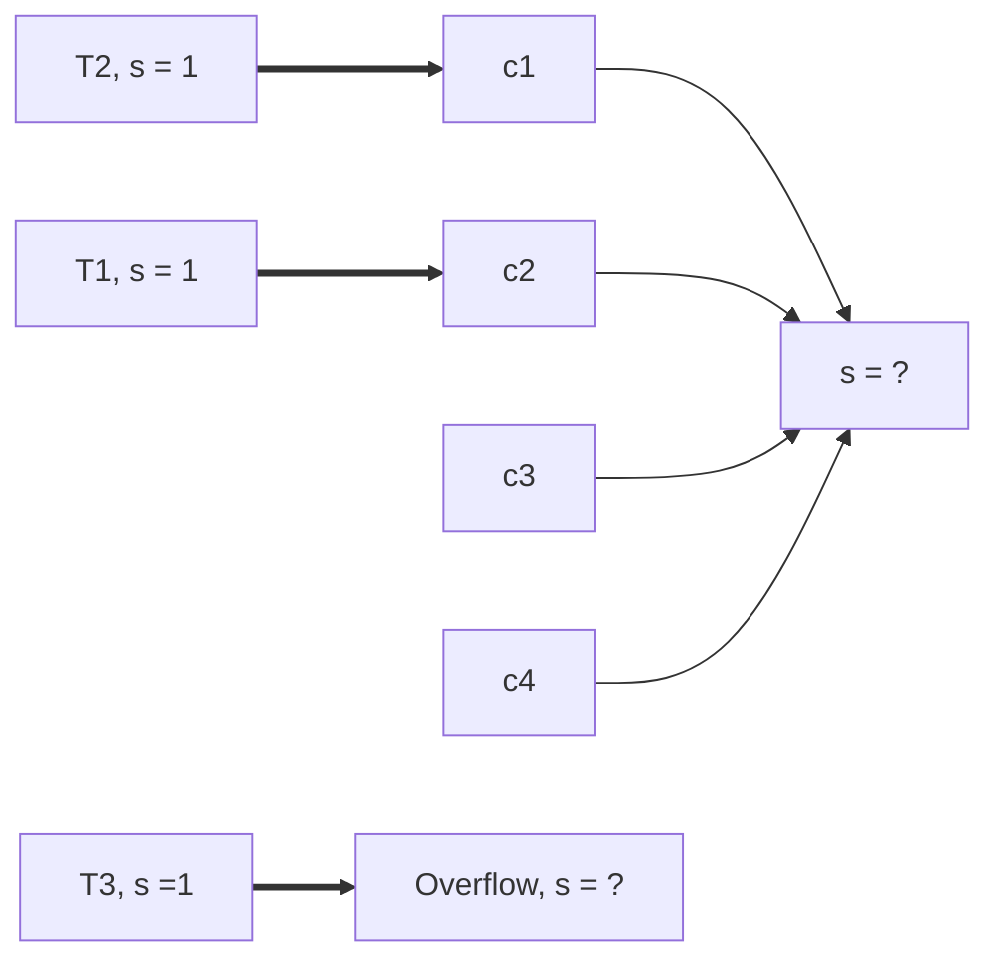

> Written with [StackEdit](https://stackedit.io/).

Suppose that this pair of dual solutions for MCF representations of two distinct 1-1 matching problems ---

```mermaid

graph LR

t1[p=4,s=1] == a=3 ==> c1((p=2))

t1 == a=1 ==> c2((p=3))

c1 --> Sink1{2<=p<=3, s=-1}

c2 --> Sink1

t2[p=40,s=1] == a=30 ==> c3((p=20))

t2 == a=10 ==> c4((p=30))

c3 --> Sink2{20<=p<=30, s=-1}

c4 --> Sink2

```

--- is to be combined to form a candidate solution for the dual of a single, combined 1-1 matching problem:

```mermaid

graph LR

t1[p=?,s=1] == a=3 ==> c1((p=?))

t1 == a=1 ==> c2((p=?))

c1 --> Sink{p=?, s=-2}

c2 --> Sink

t2[p=?,s=1] == a=30 ==> c3((p=?))

t2 == a=10 ==> c4((p=?))

c3 --> Sink

c4 --> Sink

```

Note that this combined problem neither adds or subtracts matching possibilities, treament-control arcs, nor modifies any arc costs. It's intended as the simplest possible scenario.


In the original pair of problems, I've denoted the range of prices on the sink node that can satisfy CS together with a flow that meets supply and capacity constraints. I've constructed things in such a way that these two ranges do not overlap. As a result, carrying over to the combined network the remaining nodes' prices results in a price vector that can't satisfy CS together with a feasible flow.


On the other hand, the price vectors for either of the original problems remain optimal if shifted up or down by the same amount. So one should simply shift, then merge:


```mermaid

graph LR

t1[p=4,s=1] == a=3 ==> c1((p=2))

t1 == a=1 ==> c2((p=3))

c1 --> Sink1{2<=p<=3, s=-1}

c2 --> Sink1

t2[p=40,s=1] == a=30 ==> c3((p=20))

t2 == a=10 ==> c4((p=30))

c3 --> Sink2{20<=p<=30, s=-1}

c4 --> Sink2

```


becomes


```mermaid

graph LR

t1[p=22,s=1] == a=3 ==> c1((p=20))

t1 == a=1 ==> c2((p=21))

c1 --> Sink1{20<=p<=21, s=-1}

c2 --> Sink1

t2[p=40,s=1] == a=30 ==> c3((p=20))

t2 == a=10 ==> c4((p=30))

c3 --> Sink2{20<=p<=30, s=-1}

c4 --> Sink2

```


and is then merged to give


```mermaid
graph LR
t1[p=22,s=1] == a=3 ==> c1((p=20))
t1 == a=1 ==> c2((p=21))
c1 --> Sink{20<=p<=21, s=-2}
c2 --> Sink
t2[p=40,s=1] == a=30 ==> c3((p=20))
t2 == a=10 ==> c4((p=30))
c3 --> Sink
c4 --> Sink
```


I conclude from this that when merging solutions to separate subproblems, the first thing to do is to cycle through the subproblem solutions and shift the price vectors in such a way that prices of sink nodes wind up being all the same. The example involves 1-1 matching, but I suspect the argument should lift easily to combinations of matching problems that forbid many one matches. (It may also lift to cover general full matching problems, but perhaps the presence of overflow adds complication in that case.)

## Introducing overflow node to similar networks

Suppose we are now considering a set of similar problems, but we now introduce an overflow node into the network. As before, cases considered are somewhat simplified from what they might be in an actual `optmatch` network. Other restrictions/details might also be removed or altered from `optmatch` situations.

Let's re-examine a slightly modified previous system, with the addition of a new "overflow" node. Let's also say that in this example, we are prohibiting many-one t:c matches as well.

```mermaid
graph LR
t1[p=22,s=1] -- a=4 --> c1((p=20))
t1 == a=0 ==> c2((p=21))
c1 --> Sink{20<=p<=21, s=-1}
c2 ==> Sink
t2[p=40,s=1] -- a=300 --> c3((p=20))
t2 -- a=100 --> c4((p=30))
c3 --> Sink
c4 --> Sink

t1 --> Overflow[overflow, s = -1, 21<=p<=40]
t2 ==> Overflow
```

This first example does suggest that the relationship between the sink node price and overflow price are not meaningfully related, in this particular situation, at least. Broadly speaking, the sink node is a function of the prices of the control nodes only. The overflow node is a function of both treatment and control node prices. In this particular network structure, the node price for c2 sets an upper bound for the sink node price, but forms a lower bound for the overflow node price. If this generalizes, this is noteworthy.


Abstracting some of this thought more:


Say that T1 and T2 are sending flow-- without assigning specific prices, it seems that the price of the sink node will be determined as a function of c1 -c4. Assuming supply/demand is met appropriately, the price of the sink node must be set such that it is less than or equal to both of c1 and c2-- p<=c1 and p <=c2. There might be other constraints, depending on the other aspects of the problem. However, the overflow node price must be set to be less than T3, and greater than max(c1, c2). If this second requirement was not satisfied, then flow will be directed to the overflow node from T1 or T2, rather than to a control node.

This also seems to suggest that in this type of a network, there is no reason to believe that adjusting node prices in the way described previously to merge problems will allow a simultaneous merge of overflow nodes.

### Permitting many-one treament:control matches with an overflow node

If we permit many-one t/c matches and add an overflow node, we can sketch something impossible (I think) like the following:
```mermaid
graph LR
t1[p=22,s=1] -- a = Inf--> c1((p=20))
t1 == a = 0==> c2((p=21))
c1 --> Sink{20<=p<=21, s=-1}
c2 ==> Sink
t2[p=40,s=1] --a = Inf--> c3((p=20))
t2 --a = Inf--> c4((p=30))
t2 --a = Inf--> c1
t2 ==a = 0 ==> c2
t1 --> c3
t1 --> c4
c3 --> Sink
c4 --> Sink

c2 ==> Overflow[overflow, s = -1, p <= 21]
```
If multiple T nodes are matched to a C node, then that control node will be dealing with some excess supply. How can it ever direct flow to the overflow node? the c node price must be less than the T node price from which it is receiving flow. If the overflow node price is set so that it can accept flow -- wouldn't it be better to just bypass the control node and set the overflow price more optimally to deal with that supply? Or perhaps other restrictions prevent this kind of thing...I'm not sure.
